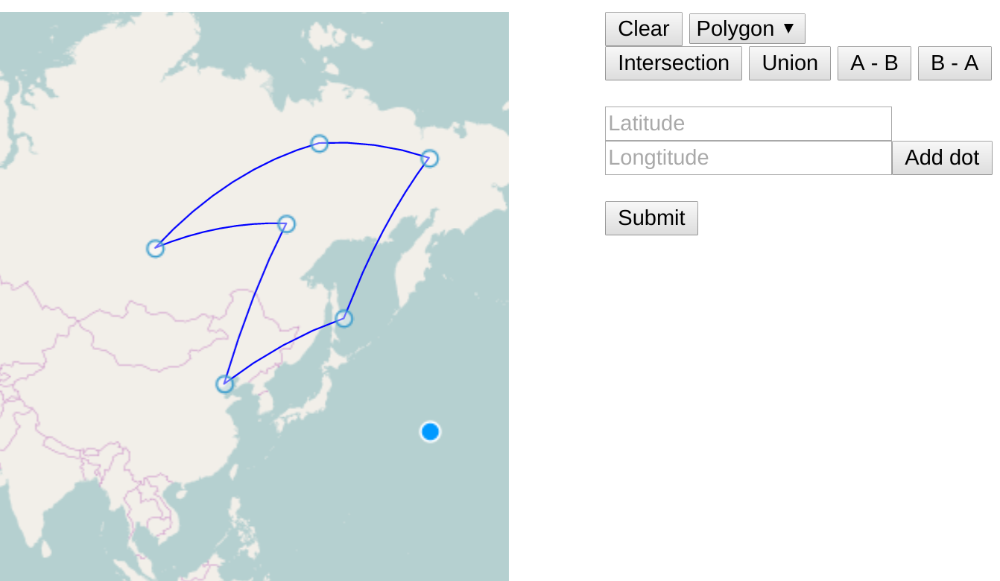
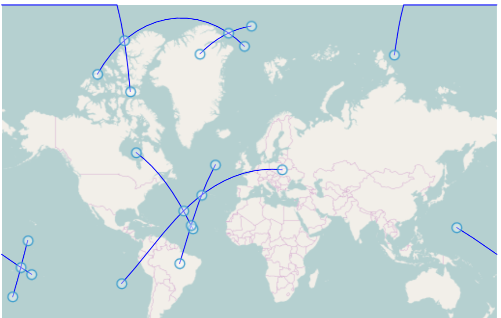
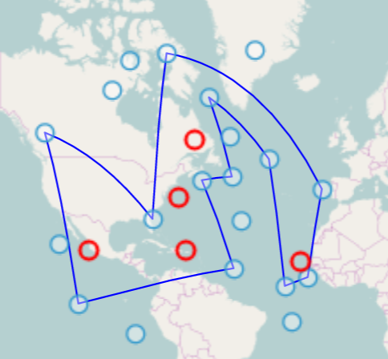
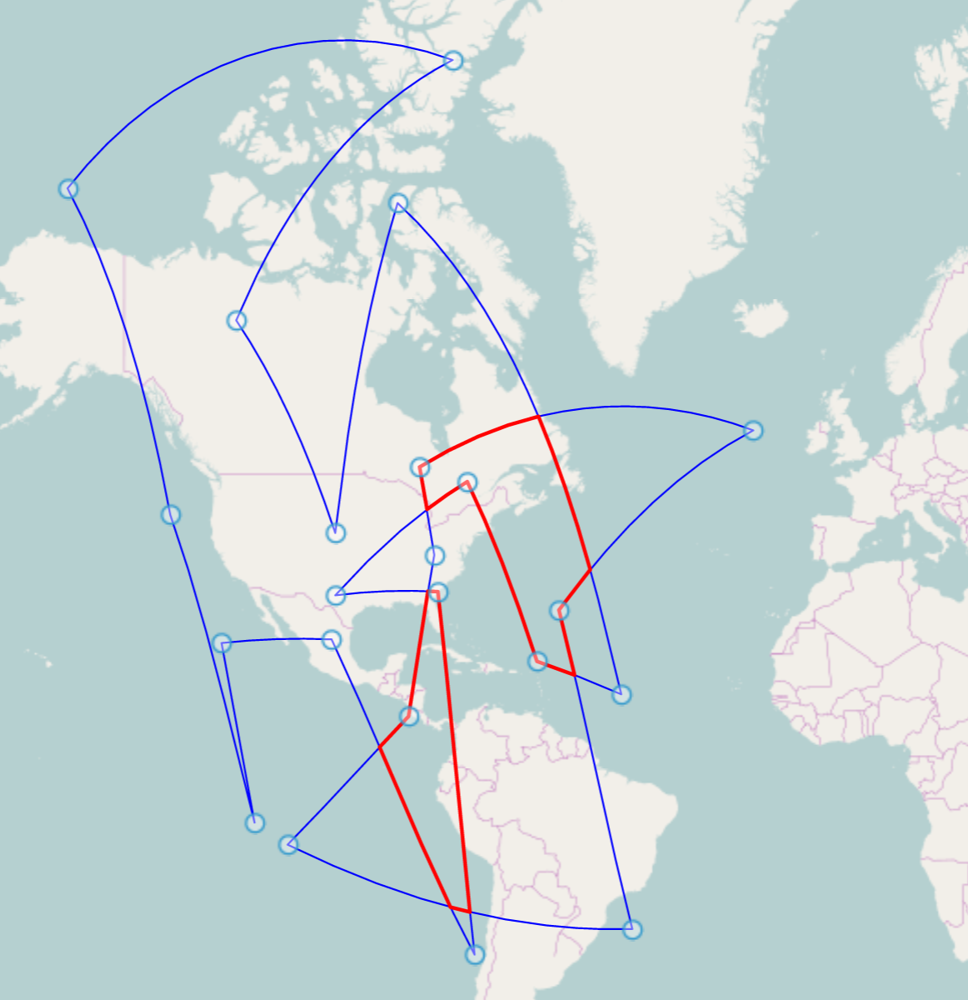
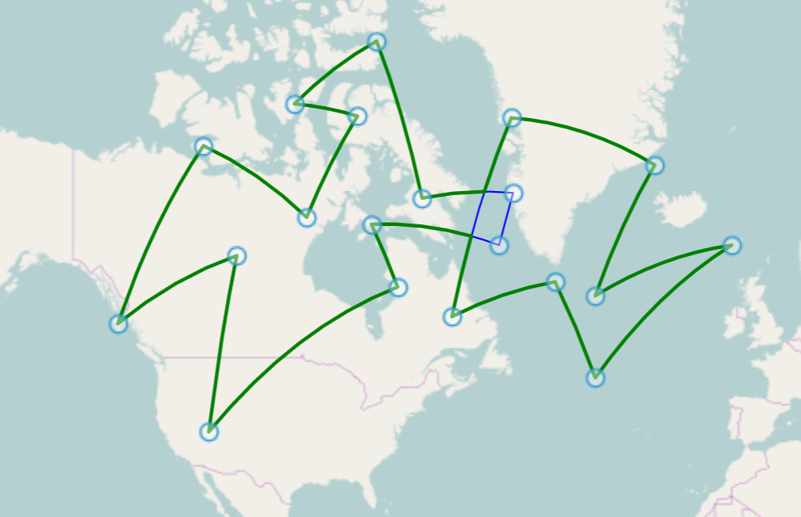

# Geo Primitives Drawing

Drawing and boolean operations with polygons on sphere

### Usage
1. ```npm install```
2. ```npm start```
3. Open index.html in browser

### Features

User can draw polygon on map using cursor or input accurate points coordinates in right menu. Using the cursor it is necessary to press ENTER key for close polygon. Polygon __must not be self-intersecting__!  
  
User can draw lines on sphere, press ENTER key and see intersection points.  
   
User can draw points, press ENTER key and see, what points are within polygons. _Warning!_ May not work correctly for polygons lying at the poles, because my algorithm is not perfect.  
    
User can perform boolean operations with two polygons.  
   
  
   
  
  

### Code
- ```arcs.js``` - lines rasterization and finding intersection point
- ```polygon.js``` - polygons drawing, point inside polygon checking (not perfect) and boolean operations by Weiler-Atherthon algorithm
- ```index.js``` - drawing figures with OpenLayers
- ```vector_features.js``` and ```geo-utils.js``` - accessory functions
