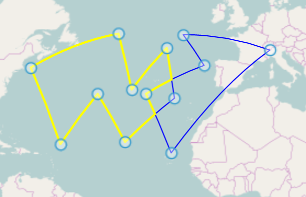

# Geo Primitives Drawing

Drawing and boolean operations with polygons on sphere

### Usage
1. ```npm install```
2. ```npm start```
3. Open index.html in browser

### Features

User can draw polygon on map using cursor or input accurate points coordinates in right menu.  
  
User can draw lines on sphere, press ENTER key and see intersection points.  
   
User can draw points, press ENTER and see, what points are within polygons. _Warning!_ May not work correctly for polygons lying at the poles, because my algorithm is not perfect.  
    
User can provide boolean operations with two polygons.  
   
  
   
  
  
